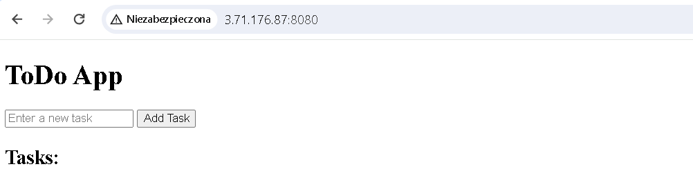
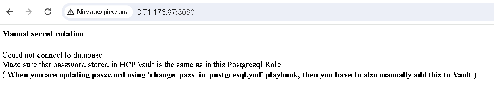
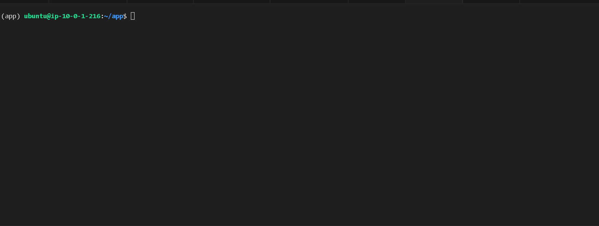

## Introduction:
Security is crucial in IT world. One aspect of security is secure authentication, e.g. web application that needs to securely connect to database.
So in this project we deploy HCP Vault as our password manager. For this demonstration, I wrote a simple ToDo web application written in Python Flask that in order to work, it needs database connection (to store notes). It uses HVAC library, to get secret password to database.

## Architecture  


### What this project covers:
- Use of AWS services, mostly to be more secure, then to provides more features to enrich our goal.
Postgresql database. It runs on EC2 instance without public IP. But it has access to internet via NAT Gateway, so it can install software, but outside world cannot connect to his machine. Access to DB is only by bastion host which in this case is ToDo app EC2 instance (best practice says that it must be dedicated host with only SSH access to private subnet). Todo server is able to connect to database, because DB has security group which only allows to connect from specific SG - here SG attached only to Todo server.

- Application security:
This project follows most of best practices  
  -Passwords
  -Environment variables to store credentials  
  -Principle of least privilege  
  -Third Party services e.g. HCP Vault and dynamic crendentials rotation and AWS auth method (in EC2 intances)  

- How to automate server provisioning - use of Terraform, User Data scripts and ansible playbooks.

### Requirements:
- AWS account
- AWS user or role credentials (access key and secret keys) for Terraform that allows to create ec2 instances, network and IAM roles
## Get started

Start with updating `terraform/variables.tf` and `ansible/vars/credentials.yml`
You can also just leave this variables and run this application with default values.
```sh
cd terraform  
terraform init  
terraform apply
ansible-playbook -i inventory_aws_ec2.yml playbooks/allow_to_access_database.yml playbooks/add_vault_public_ip_to_todo_env.yml 
```


### Part I - manual password rotation
In this Part we show how manually we can rotate password. We generate some password, e.g. 123456, and we must manually change this password in Postgresql database and in HCP Vault.

#### Change in Postgresql
Now we change password in database to this user. To make it easy, we have playbook `change_pass_in_postgresql.yml`
Because best practice is to not show everyone password, we will first encrypt password using ansible-vault
(It genera)

```
ansible-vault encrypt_string --name 'postgresql_user_password' 'new_password_value'
```
where:  
-`postgresql_user_password` is name of password variable that we use in this playbook  
-`new_password_value` is a password value

```
ansible-playbook -i inventory_aws_ec2.yml playbooks/change_pass_in_postgresql.yml --ask-vault-pass
```


And we got message like this, which says, "maybe you've changed password in database, but not in Vault"



#### Change password in HCP Vault
You can log into HCP Vault server and run command:
```
vault kv put kv/data/db/todo_app password="YOUR-PASSWORD"
```
or manually change password in HCP Vault UI on web browser (port 8200)


### Part 2 - dynamic password rotation
In this part we will use Vault database engine -postgresql. This allows us to generate password and postgresql roles dynamically with TTL credentials. So If our application turns on, then it receive very new credentials with 24h time to live. So even if our credentials leaks out, credentials are valid a certain amount of time and besides we can very quickly revoke this credentials

We must turns on this engine and loads to HCP Vault configuration (database connection parameters, new generated roles permissions etc)
Log via ssh into Vault  server:
e.g.
```
ssh -i todo-private.key ubuntu@<VAULT-IP-ADDRESS>
sed '/^.VAULT_.$/p' -n /home/ubuntu/.bashrc > temp_env; source temp_env; source /home/ubuntu/create_and_run_database_engine
```

Log via ssh into ToDo app server:
```
ssh -i todo-private.key ubuntu@<TODO-APP-IP-ADDRESS>
cd app && cp get_pass_from_vault_using_database_engine.py get_pass_from_vault.py && sudo systemctl stop todo_app.service && sudo systemctl start todo_app.service
```



I highly recommend you to go on HCP vault server website via web browser <public-ip-address>:8200 (password: root), and see all configuration we created using user data script. For more details go to terraform files, and ansible playbooks, where is all configuration.

## Explanations:
- EC2 intance needs to have IAM role `vault-role-for-aws-ec2role` attached to instance profile, because HCP Vault is configured to authenticate this specific IAM role (`auth/aws/role/vault-role-for-aws-ec2role`). In To-Do web app there is script which uses Boto3 library to assume this role and get credentials to authenticate to HCP Vault.
- Most of configuration is in Terraform files.

